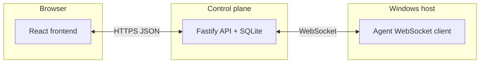

[中文文档](README.zh-CN.md)

# Sirius (Remote Windows Agent)

**Sirius** is an end-to-end **remote desktop automation** prototype. The subtitle **Remote Windows Agent** reflects the Windows-side agent that executes commands from the control plane.

**Suggested GitHub repository name:** [`sirius`](https://github.com/new) or [`sirius-remote-windows-agent`](https://github.com/new) if you want the full name in the URL.

---

## Overview

- A **WeChat-style** web client (messages, contacts, device details, optional custom “agent friends” and casual chat).
- A **control plane** (Fastify + SQLite) for **auth**, **device pairing**, **command dispatch**, **chat history**, and **LLM-assisted parsing** of natural-language commands.
- A **Windows agent** (Node.js + WebSocket) that receives commands from the control plane and runs desktop automation (logs and screenshots are reported back).

> **Scope:** MVP / demo quality. Do **not** expose to the public internet without hardening (TLS, rate limits, strong secrets, operational monitoring).

## Architecture



## Repository layout

| Path | Role |
|------|------|
| `control-plane/` | HTTP API, JWT auth, device lifecycle, parse settings, agent catalog, WebSocket bridge to agents |
| `agent/` | Node/TypeScript agent: connects with pairing code or device token, executes commands |
| `frontend/` | Vite + React UI (mobile-style shell) |
| `shared/` | Command spec JSON schema and protocol notes |

## Prerequisites

- **Node.js** 20+ recommended (for `control-plane`, `agent`, `frontend`)
- **Windows** machine (or VM) for the agent, if you want real desktop automation

## Quick start (local dev)

### 1. Control plane

```bash
cd control-plane
npm install
npm run dev
```

Default: `http://127.0.0.1:8787` (or `http://localhost:8787`).

### 2. Agent (Windows)

```bash
cd agent
npm install
npm run dev
```

On first run the terminal prints a **pairing code** and writes `agent/pairing-code.txt` next to `agent/agent-state.json`. Use that code in the web app (**Contacts → Add device**) to bind the machine.

To force a new pairing code: delete `agent/agent-state.json` and restart the agent.

### 3. Frontend

```bash
cd frontend
npm install
npm run dev
```

Open the URL Vite prints (often `http://localhost:5173`). **Register / log in**, and set the **control plane base URL** if your phone or another PC opens the UI (use the LAN IP of the machine running the control plane, **not** `localhost` from another device).

## Command parsing (rule / hybrid / LLM)

After login, use **Me → Parse settings** / **Model settings** to choose **parse mode**, vendor (Zhipu GLM, OpenAI-compatible, Gemini), model, base URL, and API key (stored in SQLite `user_parse_settings`).

APIs: `GET/PUT /me/parse-settings`, `POST /me/parse-settings/test`.

If nothing is saved in the UI, the control plane can fall back to **environment variables** (global defaults):

| Variable | Purpose |
|----------|---------|
| `COMMAND_PARSE_MODE` | `rule` \| `hybrid` \| `llm` |
| `DEFAULT_LLM_PROVIDER` | `zhipu` \| `openai_compatible` \| `gemini` |
| `ZHIPU_API_KEY` / `ZHIPU_MODEL` / `ZHIPU_API_BASE` | Zhipu defaults |
| `OPENAI_API_KEY` or `OPENAI_COMPAT_API_KEY` or `DEEPSEEK_API_KEY` | OpenAI-compatible fallback |
| `OPENAI_BASE_URL` / `OPENAI_COMPAT_BASE_URL` | OpenAI-compatible base URL |
| `GEMINI_API_KEY` | Gemini fallback |
| `COMMAND_TEXT_MAX_CHARS` | Max chars sent to the model (default `900`) |

If no usable key is configured or the model fails, parsing falls back to the **rule engine**.

## Production notes

- Prefer **HTTPS** and a real **JWT secret** (`JWT_SECRET` on the control plane).
- Protect `control-plane.sqlite` (contains user hashes, parse settings, device tokens).
- Plan for **device revocation**, audit logs, and backups before any wide deployment.

## License

No license file is bundled yet. Add a `LICENSE` (e.g. MIT) before publishing if you want a standard open-source grant.

## Quick links

- Control plane default port: **8787**
- Frontend dev default (Vite): **5173**
- Pairing artifact: `agent/pairing-code.txt`
