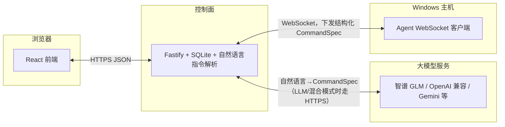
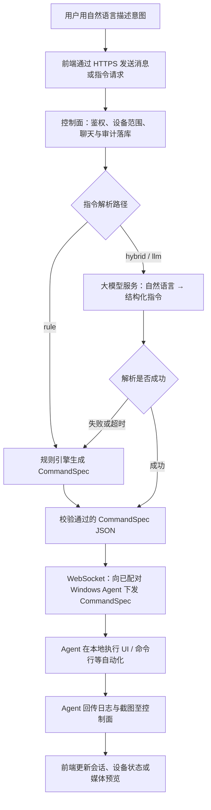

[English README](README.md)

# Sirius（Remote Windows Agent）

**Sirius** 是一套精简、可跑通的 **远程 Windows 自动化** 演示：围绕 **会话式 Web 前端** 与 **Fastify + SQLite 控制面**，把用户与设备配对、会话与审计放在同一条链路里。你在界面里用 **自然语言** 描述意图，控制面通过 **规则 / 混合 / 大模型** 解析为可校验的 **CommandSpec（JSON）**，由 **Node.js WebSocket Agent** 在 Windows 本机执行，并把日志与截图回传到前端。副标题 **Remote Windows Agent** 指的就是这台「在电脑上动手」的执行端，而不是单独指云端大模型。

**建议的 GitHub 仓库名：** [`sirius`](https://github.com/new)，若希望 URL 与全称一致可选用 [`sirius-remote-windows-agent`](https://github.com/new)。

---

## 项目简介

- **类微信** Web 前端：消息列表、通讯录（设备 / Agent）、详情页、会话内设置等。
- **控制面**（Fastify + SQLite）：用户注册登录（JWT）、**设备配对与吊销**、**指令下发与审计**、设备聊天记录、**自然语言解析**（规则 / 混合 / 大模型）及内置对话 Agent 等。
- **Windows Agent**（Node.js + WebSocket）：连接控制面，接收指令并执行桌面自动化，回传日志与截图。

> **定位：** MVP / 演示用途。若部署到公网，请务必加固（HTTPS、限流、强密钥、监控与备份等）。

## AI 在本项目中的作用

这里的 AI 不是“挂个模型”的噱头，而是把 **人用自然语言表达的意图** 转成 **Windows Agent 能执行、且可被协议约束的结构化指令** 的核心环节。

- **自然语言 → 结构化指令。** 你在前端用口语描述目标（例如「打开记事本并输入 hello」），控制面将其解析为 Agent 认识的 **CommandSpec（JSON）**；解析路径支持 **纯规则**、**规则 + 大模型（混合）**、**以大模型为主**，可在 **「我」→ 解析 / 模型设置** 中按用户配置。
- **多厂商接入。** 同一套流程可对接智谱 GLM、OpenAI 兼容接口（含常见代理）、Gemini；密钥与模型参数写入 SQLite，也可用 **环境变量** 作为实验室或单租户场景的全局默认。
- **可降级。** 未配置密钥、模型调用失败或显式选择 **规则** 模式时，会 **回退到规则解析**，保证不依赖云端大模型也能完成基础自动化演示。
- **与「聊天式」产品形态一致。** 前端刻意做成类微信体验：会话、通讯录与设备控制并列，便于把 **大模型辅助解析** 与 **闲聊 / Agent 人设** 放在同一套交互心智里；自动化载荷与纯聊天在控制面侧仍应区分处理。

API Key 与解析配置等同于敏感凭据，会直接影响已配对机器上可被解释执行的指令，请仅在可信环境中使用。

## 架构



## 端到端流程（自然语言 → 桌面执行）



**混合（hybrid）** 模式通常会先尝试规则再视情况调用大模型；**大模型（llm）** 在无密钥或调用失败时也会与 **规则** 一样走回退路径。

## 目录结构

| 路径 | 说明 |
|------|------|
| `control-plane/` | HTTP API、鉴权、设备与聊天、解析配置、与 Agent 的 WebSocket |
| `agent/` | Node/TypeScript Windows Agent |
| `frontend/` | Vite + React 前端 |
| `shared/` | 指令 `CommandSpec` JSON Schema 与协议说明 |

## 环境要求

- **Node.js** 建议 20+
- 需要 **Windows** 真机或虚拟机运行 Agent（桌面自动化）

## 快速开始（本地开发）

### 1. 启动控制面

```bash
cd control-plane
npm install
npm run dev
```

默认监听：`http://127.0.0.1:8787`。

### 2. 启动 Agent（在 Windows 上）

```bash
cd agent
npm install
npm run dev
```

首次启动会在终端打印 **配对码**，并写入 **`agent/pairing-code.txt`**（与 `agent/agent-state.json` 同级）。在网页 **通讯录 → 添加设备** 中填写配对码与设备名称完成绑定。

若需重新配对：删除 `agent/agent-state.json` 后重启 Agent。

### 3. 启动前端

```bash
cd frontend
npm install
npm run dev
```

浏览器打开 Vite 提示的地址。**注册 / 登录** 后，若用手机或其他电脑访问前端，请在登录页或「我」中把 **控制面 API 地址** 填成 **运行控制面那台机器的局域网 IP**（例如 `http://192.168.1.5:8787`），不要误用手机上的 `localhost`。

## 命令解析（规则 / 混合 / 大模型）

登录后在 **「我」** 子页可配置 **解析模式**、厂商、模型、Base URL、API Key（写入控制面 SQLite）。接口：`GET/PUT /me/parse-settings`，`POST /me/parse-settings/test` 用于连通性检测。

未在页面保存时，控制面可读 **环境变量** 作为全局默认，变量说明见 [英文 README](README.md) 中的表格。无可用密钥或大模型失败时会 **回退到规则解析**。

## 安全提示

- 仅在 **可信环境** 内测试；数据库与设备令牌等同密钥，请妥善保管。
- 公网部署务必 **HTTPS**、强 `JWT_SECRET`、设备吊销策略与审计。

## 许可证

本项目采用 **Apache License 2.0**，详见仓库根目录 [LICENSE](LICENSE)。

## 相关链接

- 控制面默认端口：**8787**
- 前端开发默认端口（Vite）：**5173**
- 配对码文件：`agent/pairing-code.txt`
